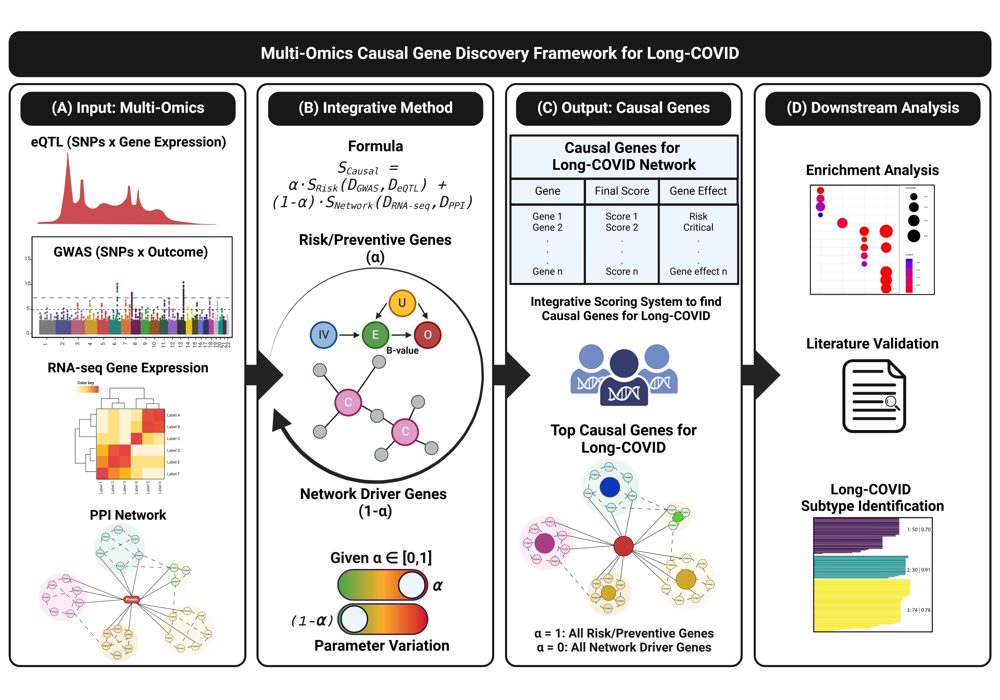
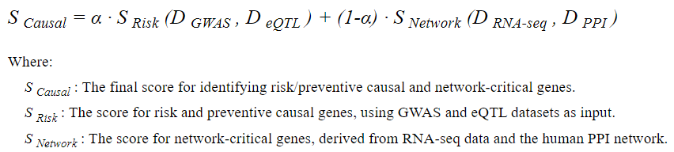
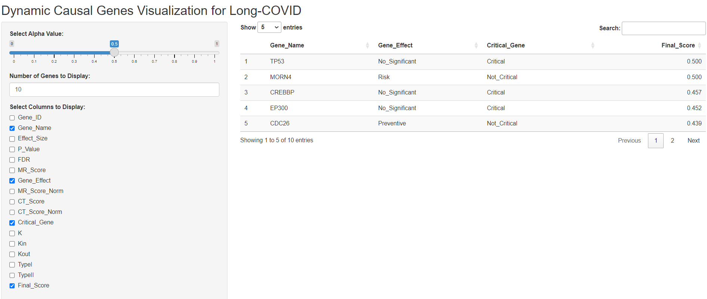

# Integrative Multi-Omics Framework for Causal Gene Discovery in Long COVID

[](https://coveralls.io/github/USERNAME/REPO_NAME?branch=main)

[](https://github.com/USERNAME/REPO_NAME/actions)

[](LICENSE)

[](https://orcid.org/0000-0002-6296-6412)

## Overview

This repository contains the code and necessary datasets for a novel bioinformatics framework that employs causality to identify genes potentially driving Long-COVID. Our approach integrates multi-omics data to find causal genes that influence the risk and prevention of Long-COVID, as well as the stability of its associated biological networks.

## Purpose

The goal of this project is to develop an advanced causal inference framework for multi-omics data in order to:
- Identify genes that may increase or decrease the risk of developing Long-COVID.
- Determine the role of these genes in maintaining the stability of biological networks affected by Long-COVID.
- Provide a ranked list of candidate genes that could be targeted for therapeutic intervention or further research.

## Methodology

Out framework integrates data from multiple omics layers (e.g., genomics, transcriptomics, proteomics) and calculate a score to identify key network drivers genes for Long-COVID. 



Specifically, we:

**Integrated Framework for Long-COVID Causal Gene Identification**

This framework combines advanced techniques (Mendelian Randomization: Mt_Robin (Multi-tissue transcriptome-wide Mendelian Randomization method ROBust to INvalid instrumental variables) [Mr.MtRobin Repository](https://github.com/kjgleason/Mr.MtRobin) [Reference](https://doi.org/10.1002/gepi.22380) and Control Theory: Controllability Analysis (CA) [Reference](https://www.pnas.org/doi/full/10.1073/pnas.1603992113)) to identify key genes associated with Long-COVID by integrating data from [GWAS](https://www.medrxiv.org/content/10.1101/2023.06.29.23292056v1), [eQTL](https://gtexportal.org/home/datasets), [PPI](https://www.pnas.org/doi/full/10.1073/pnas.1603992113), and [RNA-seq](https://www.ncbi.nlm.nih.gov/geo/query/acc.cgi?acc=GSE215865) datasets. The focus is on identifying protein-coding genes that play crucial roles in disease mechanisms, applying rigorous selection criteria to ensure the relevance and robustness of the results.

### Selection Process

1. **Candidate SNP Identification**: The framework begins by identifying candidate Single Nucleotide Polymorphisms (SNPs) that serve as instrumental variables (IVs) for each gene. The selection process is applied to all genes, with the final analysis focusing exclusively on protein-coding genes.

2. **Threshold Criteria**:
   - **LD Threshold**: SNPs with a Linkage Disequilibrium (LD) correlation greater than 0.5 with another SNP in the pool are excluded.
   - **P-value Threshold 1**: Only SNPs with a p-value less than 0.001 are considered significant.
   - **Number of Tissues Threshold**: SNPs showing significant effects in at least one tissue are retained.
   - **P-value Threshold 2**: Genes with a p-value and False Discovery Rate (FDR) less than or equal to 0.05 are retained.

3. **Long-COVID Network**: The framework evaluates the roles of these genes within the human protein-coding gene network, focusing on their degree (K), in-degree (Kin), and out-degree (Kout). The genes are classified into specific categories based on their indispensability and criticality in network control:
   - **Indispensable and Critical Genes**: The analysis highlights genes that are crucial for network control, subdividing them into:
     - **Type I Critical Genes**: Genes whose removal increases the number of driver nodes (N_D), indicating their essential role in maintaining control within the network.
     - **Type II Critical Genes**: Genes that must always be controlled, belonging to all driver node sets, and characterized by zero in-degree (Kin=0).

4. **Final Score Calculation:**  
   For each gene, a weighted score is computed based on its contributions to risk and prevention, adjusted by a user-defined parameter (`alpha`). The final score is calculated by combining the normalized Mendelian Randomization Score (`MR_Score_norm`) and Control Theory Score (`CT_Score_norm`).

   We developed the following equation to identify the risk/preventive causal and network-critical genes for Long-COVID:



5. **Summarize and rank genes:**  
   Genes are ranked based on their Final Scores, with additional annotations indicating their effect (Risk/Preventive) and their criticality in biological networks, specifically highlighting whether they are classified as indispensable Type-I or Type-II critical genes in the context of Long-COVID.

6. **Generate a detailed report:**  
   The top candidate genes are outputted to a CSV file, with a summary of key statistics provided. The report includes:
   - Total number of genes analyzed.
   - Number of selected genes based on the Final Score.
   - Number of Risk genes, Preventive genes, and Critical genes (Type-I and Type-II) for both the entire dataset and the selected subset.

### Framework Outcome

The integrated framework filters and ranks genes based on their contributions to Long-COVID pathogenesis, with a special focus on those that are both indispensable and critical within the protein-coding gene network. This comprehensive approach ensures that the final set of identified genes is not only statistically significant but also biologically essential for network control, providing valuable insights into potential therapeutic targets for Long-COVID.

### Definitions

**Indispensable Genes**:  
These are protein-coding genes crucial for maintaining the controllability of the Long-COVID network. If removed, they increase the number of driver nodes (\(ND\)) required to control the network. Indispensable genes are further classified into two categories, Type-I and Type-II, which reflect their different roles and impact across various network states.

**Type-I Genes**:  
These genes are defined by their direct effect on the controllability of the network, as measured by their influence on the number of driver nodes (\(ND\)):
- **Critical**: The removal of a critical Type-I gene increases \(ND\), meaning the network requires more driver nodes for control when this gene is absent.
- **Redundant**: The removal of a redundant Type-I gene decreases \(ND\), meaning fewer driver nodes are needed to control the network when this gene is absent.
- **Ordinary**: The removal of an ordinary Type-I gene does not change \(ND\), meaning it has no effect on the number of driver nodes required for network control.

**Type-II Genes**:  
These genes are classified based on their participation in driver node sets, which are sets of nodes that must be controlled to maintain network controllability:
- **Critical**: A critical Type-II gene must be present in all driver node sets, meaning it always plays a role in network control.
- **Redundant**: A redundant Type-II gene is absent from all driver node sets, meaning it is never required for network control.
- **Ordinary**: An ordinary Type-II gene is present in some but not all driver node sets, meaning it plays a role in network control in certain contexts but not universally.

**Driver Nodes (\(ND\))**:  
Driver nodes are key nodes in the network that must be controlled to ensure the network's overall functionality. An increase in the number of driver nodes suggests a greater level of complexity or difficulty in controlling the network, while a decrease indicates a reduction in the effort required for control.

## Files in This Repository

- **`generate_report_function.R`:** The primary R script containing the function to calculate Final Scores, rank genes, and generate a summary report.
- **`input_data/`:** A directory containing the input datasets required for running the analysis (e.g., normalized scores for genes across different omics layers).
- **`results/`:** Output directory for the generated reports and ranked gene lists.

## System Requirements

### Operating Systems Tested On
- Windows 11 Enterprise

### Required Non-Standard Hardware
- **GADI Supercomputer** (used for the First Part of the Project - [MR](https://colab.research.google.com/drive/1q8MZ_262cyIQcgVW5rhS8-QAdhRAFjq8?usp=sharing)):
  - **NCPUs:** 48
  - **Memory:** 500GB
  - **Job Specifications:**
    - **Job 1:** 48 CPUs, 391.58GB memory used
    - **Job 2:** 36 CPUs, 77.45GB memory used
    - **Job 3:** 36 CPUs, 9.67GB memory used
  - **Software Stack:**
    - R version 4.2.2 (via Docker)
    - Libraries: `libcurl4-openssl-dev`, `libssl-dev`, `libxml2-dev`, `libicu-dev`, `liblapack-dev`, `libblas-dev`, `gfortran`, `nloptr`, `lme4`, `data.table`, `mvtnorm`.

## Dependencies

- **R** version 4.2.0 [(R Project)](https://www.r-project.org/)
- **biomaRt** (version 2.58.0) [(biomaRt)](https://bioconductor.org/packages/release/bioc/html/biomaRt.html)
- **CancerSubtypes** [(CancerSubtypes)](https://bioconductor.org/packages/release/bioc/html/CancerSubtypes.html)
- **dplyr** (version 1.1.4) [(dplyr)](https://cran.r-project.org/web/packages/dplyr/index.html)
- **tidyverse** (version 2.0.0) [(tidyverse)](https://www.tidyverse.org/)
- **data.table** (version 1.14.10) [(data.table)](https://cran.r-project.org/web/packages/data.table/index.html)
- **lme4** (version 1.1-35.1) [(lme4)](https://cran.r-project.org/web/packages/lme4/index.html)
- **httr** (version 1.4.7) [(httr)](https://cran.r-project.org/web/packages/httr/index.html)
- **jsonlite** (version 1.8.8) [(jsonlite)](https://cran.r-project.org/web/packages/jsonlite/index.html)
- **VennDiagram** (version 1.7.3) [(VennDiagram)](https://cran.r-project.org/web/packages/VennDiagram/index.html)
- **ggplot2** (version 3.4.4) [(ggplot2)](https://ggplot2.tidyverse.org/)
- **cowplot** (version 1.1.2) [(cowplot)](https://cran.r-project.org/web/packages/cowplot/index.html)
- **visNetwork** (version 2.1.2) [(visNetwork)](https://cran.r-project.org/web/packages/visNetwork/index.html)
- **clusterProfiler** (version 4.10.0) [(clusterProfiler)](https://bioconductor.org/packages/release/bioc/html/clusterProfiler.html)
- **ReactomePA** (version 1.46.0) [(ReactomePA)](https://bioconductor.org/packages/release/bioc/html/ReactomePA.html)
- **org.Hs.eg.db** (version 3.18.0) [(org.Hs.eg.db)](https://bioconductor.org/packages/release/data/annotation/html/org.Hs.eg.db.html)
- **Cytoscape** (version 3.10.1) [(Cytoscape)](https://cytoscape.org/)

## Colab Notebooks

The complete code implementation and all corresponding outputs are available in these Google Colab notebooks for your reference.
- [MR](https://colab.research.google.com/drive/1q8MZ_262cyIQcgVW5rhS8-QAdhRAFjq8?usp=sharing)
- [CT](https://colab.research.google.com/drive/1_-Whh9z_Egl4VQQ2sSj-4nn6A85jS4fQ?usp=sharing)
- [EA](https://colab.research.google.com/drive/1BHoDQ6U4Qd7HDkqbB5qgoBzqX3Kil46T?usp=drive_link)
- [Shinny_App](https://colab.research.google.com/drive/1cJRpwP4YgFkTuyQPPUmyceku5td1UsEr?usp=drive_link)

## How to Use

**Option 1: Dynamic Causal Genes Visualization for Long-COVID Network**

You can dynamically explore shifts in gene rankings using our interactive tool available at [Dynamic Causal Genes Visualization in a Long-COVID Network](https://sindypin.shinyapps.io/github/). This tool allows users to adjust the parameter `alpha`, enabling a detailed examination of how genes transition from being network-critical (`alpha = 0`) to focusing more on disease risk or prevention (`alpha = 1`).

By adjusting \(\alpha\), you can customize insights into gene roles based on their specific research objectives, whether those objectives involve network dynamics, genetic risk factors, or a combination of both.



**Option 2: Clone the Repository to Modify Results**

1. Clone this repository to your local machine:
   ```bash
   git clone https://github.com/SindyPin/Causal-Multiomics-Method
   ```

2. The input data is provided in the `input_data/` directory. You do not need to supply any additional data.

3. Load the R script and run the `generate_report` function with the provided dataset and desired parameters:

   General Results:
   - Number of Risk genes: 406 
   - Number of Preventive genes: 402 
   - Number of TypeI Critical genes: 1334 
   - Number of TypeII Critical genes: 387 
   - Total number of genes: 6963
---
   - Check `alpha=1.0`:
   ```R
   source("generate_report_function.R")
   generate_report(file_path = "input_data/mt_robin_CT.csv", alpha = 1, num_genes_to_print = 16, output_file = "results/gene_report.csv")
   ```
   Output:
   - Total Number of Protein-coding genes in the dataset: 6339
   - Total Number of Selected Protein-coding genes: 16
   - Number of Selected Risk genes: 9
   - Number of Selected Preventive genes: 7
   - Number of Selected TypeI Critical genes: 0
   - Number of Selected TypeII Critical genes: 0 

| Rank|gene_name | MR_Score_norm| CT_Score_norm| Final_Score|Gene_Effect |Critical_Gene |
|----:|:---------|-------------:|-------------:|-----------:|:-----------|:-------------|
|    1|MORN4     |     1.0000000|             0|   1.0000000|Risk        |Not_Critical  |
|    2|CDC26     |     0.8778914|             0|   0.8778914|Preventive  |Not_Critical  |
|    3|EIF5A     |     0.6141077|             0|   0.6141077|Risk        |Not_Critical  |
|    4|VWDE      |     0.4532133|             0|   0.4532133|Risk        |Not_Critical  |
|    5|GMPPB     |     0.3882238|             0|   0.3882238|Risk        |Not_Critical  |
|    6|NDUFA6    |     0.2860991|             0|   0.2860991|Risk        |Not_Critical  |
|    7|BNIP1     |     0.2628553|             0|   0.2628553|Risk        |Not_Critical  |
|    8|CERS4     |     0.2280826|             0|   0.2280826|Preventive  |Not_Critical  |
|    9|ADAT1     |     0.2254065|             0|   0.2254065|Preventive  |Not_Critical  |
|   10|C19orf18  |     0.2252227|             0|   0.2252227|Risk        |Not_Critical  |
|   11|BOLA2     |     0.1787183|             0|   0.1787183|Preventive  |Not_Critical  |
|   12|CDA       |     0.1774153|             0|   0.1774153|Preventive  |Not_Critical  |
|   13|MORN3     |     0.1429947|             0|   0.1429947|Risk        |Not_Critical  |
|   14|ITPRID1   |     0.1419264|             0|   0.1419264|Preventive  |Not_Critical  |
|   15|BTN3A1    |     0.1407982|             0|   0.1407982|Preventive  |Not_Critical  |
|   16|ATOSA     |     0.0642437|             0|   0.0642437|Risk        |Not_Critical  |

---

   - Check `alpha=0.75`:
   ```R
   source("generate_report_function.R")
   generate_report(file_path = "input_data/mt_robin_CT.csv", alpha = 0.75, num_genes_to_print = 10, output_file = "results/gene_report.csv")
   ```
   Output:
   - Total Number of Protein-coding genes in the dataset: 6339
   - Total Number of Selected Protein-coding genes: 16
   - Number of Selected Risk genes: 7
   - Number of Selected Preventive genes: 3
   - Number of Selected TypeI Critical genes: 6
   - Number of Selected TypeII Critical genes: 0 

| Rank|gene_name | MR_Score_norm| CT_Score_norm| Final_Score|Gene_Effect    |Critical_Gene |
|----:|:---------|-------------:|-------------:|-----------:|:--------------|:-------------|
|    1|MORN4     |     1.0000000|     0.0000000|   0.7500000|Risk           |Not_Critical  |
|    2|CDC26     |     0.8778914|     0.0000000|   0.6584185|Preventive     |Not_Critical  |
|    3|EIF5A     |     0.6141077|     0.0000000|   0.4605808|Risk           |Not_Critical  |
|    4|VWDE      |     0.4532133|     0.0000000|   0.3399100|Risk           |Not_Critical  |
|    5|GMPPB     |     0.3882238|     0.0000000|   0.2911678|Risk           |Not_Critical  |
|    6|TP53      |     0.0000000|     1.0000000|   0.2500000|No_Significant |TypeI         |
|    7|CREBBP    |     0.0000000|     0.9130435|   0.2282609|No_Significant |TypeI         |
|    8|EP300     |     0.0000000|     0.9030100|   0.2257525|No_Significant |TypeI         |
|    9|NDUFA6    |     0.2860991|     0.0000000|   0.2145743|Risk           |Not_Critical  |
|   10|YWHAG     |     0.0000000|     0.8428094|   0.2107023|No_Significant |TypeI         |
|   11|BNIP1     |     0.2628553|     0.0000000|   0.1971415|Risk           |Not_Critical  |
|   12|SMAD3     |     0.0000000|     0.7525084|   0.1881271|No_Significant |TypeI         |
|   13|GRB2      |     0.0000000|     0.7023411|   0.1755853|No_Significant |TypeI         |
|   14|CERS4     |     0.2280826|     0.0000000|   0.1710619|Preventive     |Not_Critical  |
|   15|ADAT1     |     0.2254065|     0.0000000|   0.1690549|Preventive     |Not_Critical  |
|   16|C19orf18  |     0.2252227|     0.0000000|   0.1689170|Risk           |Not_Critical  |

---
   - Check `alpha=0.5`:
   ```R
   source("generate_report_function.R")
   generate_report(file_path = "input_data/mt_robin_CT.csv", alpha = 0.5, num_genes_to_print = 10, output_file = "results/gene_report.csv")
   ```
   Output:
   - Total Number of Protein-coding genes in the dataset: 6339
   - Total Number of Selected Protein-coding genes: 16
   - Number of Selected Risk genes: 2
   - Number of Selected Preventive genes: 1
   - Number of Selected TypeI Critical genes: 13
   - Number of Selected TypeII Critical genes: 0 

| Rank|gene_name | MR_Score_norm| CT_Score_norm| Final_Score|Gene_Effect    |Critical_Gene |
|----:|:---------|-------------:|-------------:|-----------:|:--------------|:-------------|
|    1|TP53      |     0.0000000|     1.0000000|   0.5000000|No_Significant |TypeI         |
|    2|MORN4     |     1.0000000|     0.0000000|   0.5000000|Risk           |Not_Critical  |
|    3|CREBBP    |     0.0000000|     0.9130435|   0.4565217|No_Significant |TypeI         |
|    4|EP300     |     0.0000000|     0.9030100|   0.4515050|No_Significant |TypeI         |
|    5|CDC26     |     0.8778914|     0.0000000|   0.4389457|Preventive     |Not_Critical  |
|    6|YWHAG     |     0.0000000|     0.8428094|   0.4214047|No_Significant |TypeI         |
|    7|SMAD3     |     0.0000000|     0.7525084|   0.3762542|No_Significant |TypeI         |
|    8|GRB2      |     0.0000000|     0.7023411|   0.3511706|No_Significant |TypeI         |
|    9|SRC       |     0.0000000|     0.6521739|   0.3260870|No_Significant |TypeI         |
|   10|EIF5A     |     0.6141077|     0.0000000|   0.3070538|Risk           |Not_Critical  |
|   11|AR        |     0.0000000|     0.5986622|   0.2993311|No_Significant |TypeI         |
|   12|ESR1      |     0.0000000|     0.5819398|   0.2909699|No_Significant |TypeI         |
|   13|RB1       |     0.0000000|     0.5652174|   0.2826087|No_Significant |TypeI         |
|   14|CSNK2A1   |     0.0000000|     0.5518395|   0.2759197|No_Significant |TypeI         |
|   15|SMAD2     |     0.0000000|     0.5384615|   0.2692308|No_Significant |TypeI         |
|   16|CDKN1A    |     0.0000000|     0.5284281|   0.2642140|No_Significant |TypeI         |

---
   - Check `alpha=0.25`:
   ```R
   source("generate_report_function.R")
   generate_report(file_path = "input_data/mt_robin_CT.csv", alpha = 0.25, num_genes_to_print = 10, output_file = "results/gene_report.csv")
   ```
   Output:
   - Total Number of Protein-coding genes in the dataset: 6339
   - Total Number of Selected Protein-coding genes: 16
   - Number of Selected Risk genes: 0
   - Number of Selected Preventive genes: 0
   - Number of Selected TypeI Critical genes: 16
   - Number of Selected TypeII Critical genes: 0 

| Rank|gene_name | MR_Score_norm| CT_Score_norm| Final_Score|Gene_Effect    |Critical_Gene |
|----:|:---------|-------------:|-------------:|-----------:|:--------------|:-------------|
|    1|TP53      |             0|     1.0000000|   0.7500000|No_Significant |TypeI         |
|    2|CREBBP    |             0|     0.9130435|   0.6847826|No_Significant |TypeI         |
|    3|EP300     |             0|     0.9030100|   0.6772575|No_Significant |TypeI         |
|    4|YWHAG     |             0|     0.8428094|   0.6321070|No_Significant |TypeI         |
|    5|SMAD3     |             0|     0.7525084|   0.5643813|No_Significant |TypeI         |
|    6|GRB2      |             0|     0.7023411|   0.5267559|No_Significant |TypeI         |
|    7|SRC       |             0|     0.6521739|   0.4891304|No_Significant |TypeI         |
|    8|AR        |             0|     0.5986622|   0.4489967|No_Significant |TypeI         |
|    9|ESR1      |             0|     0.5819398|   0.4364548|No_Significant |TypeI         |
|   10|RB1       |             0|     0.5652174|   0.4239130|No_Significant |TypeI         |
|   11|CSNK2A1   |             0|     0.5518395|   0.4138796|No_Significant |TypeI         |
|   12|SMAD2     |             0|     0.5384615|   0.4038462|No_Significant |TypeI         |
|   13|CDKN1A    |             0|     0.5284281|   0.3963211|No_Significant |TypeI         |
|   14|MAPK1     |             0|     0.5250836|   0.3938127|No_Significant |TypeI         |
|   15|FYN       |             0|     0.5117057|   0.3837793|No_Significant |TypeI         |
|   16|HDAC1     |             0|     0.5050167|   0.3787625|No_Significant |TypeI         |

---
   - Check `alpha=0.00`:
   ```R
   source("generate_report_function.R")
   generate_report(file_path = "input_data/mt_robin_CT.csv", alpha = 0.00, num_genes_to_print = 10, output_file = "results/gene_report.csv")
   ```
   Output:
   - Total Number of Protein-coding genes in the dataset: 6339
   - Total Number of Selected Protein-coding genes: 16
   - Number of Selected Risk genes: 0
   - Number of Selected Preventive genes: 0
   - Number of Selected TypeI Critical genes: 16
   - Number of Selected TypeII Critical genes: 0 

| Rank|gene_name | MR_Score_norm| CT_Score_norm| Final_Score|Gene_Effect    |Critical_Gene |
|----:|:---------|-------------:|-------------:|-----------:|:--------------|:-------------|
|    1|TP53      |             0|     1.0000000|   1.0000000|No_Significant |TypeI         |
|    2|CREBBP    |             0|     0.9130435|   0.9130435|No_Significant |TypeI         |
|    3|EP300     |             0|     0.9030100|   0.9030100|No_Significant |TypeI         |
|    4|YWHAG     |             0|     0.8428094|   0.8428094|No_Significant |TypeI         |
|    5|SMAD3     |             0|     0.7525084|   0.7525084|No_Significant |TypeI         |
|    6|GRB2      |             0|     0.7023411|   0.7023411|No_Significant |TypeI         |
|    7|SRC       |             0|     0.6521739|   0.6521739|No_Significant |TypeI         |
|    8|AR        |             0|     0.5986622|   0.5986622|No_Significant |TypeI         |
|    9|ESR1      |             0|     0.5819398|   0.5819398|No_Significant |TypeI         |
|   10|RB1       |             0|     0.5652174|   0.5652174|No_Significant |TypeI         |
|   11|CSNK2A1   |             0|     0.5518395|   0.5518395|No_Significant |TypeI         |
|   12|SMAD2     |             0|     0.5384615|   0.5384615|No_Significant |TypeI         |
|   13|CDKN1A    |             0|     0.5284281|   0.5284281|No_Significant |TypeI         |
|   14|MAPK1     |             0|     0.5250836|   0.5250836|No_Significant |TypeI         |
|   15|FYN       |             0|     0.5117057|   0.5117057|No_Significant |TypeI         |
|   16|HDAC1     |             0|     0.5050167|   0.5050167|No_Significant |TypeI         |

5. The function will output a ranked list of genes and a summary of the results to the specified output file.

## Dependencies

- **R** version 4.0 or later
- R libraries: `dplyr`, `knitr`, `pander`

Install the required libraries in R:
```R
install.packages(c("dplyr", "knitr", "pander"))
```

## Customization

Applying the same framework, users can modify the input data to analyze other diseases and apply other MR and CT methods to explore different conditions or datasets.

## Contributing

We welcome contributions from the community! If you would like to contribute to this project, please fork the repository and submit a pull request. For major changes, please open an issue first to discuss what you would like to change.

## License

This project is licensed under the MIT License. See the [LICENSE](LICENSE) file for details.

## Contact

For any questions or issues, please open an issue in this repository or contact the project lead at [sindypin2005@gmail.com](mailto:sindypin2005@gmail.com).
